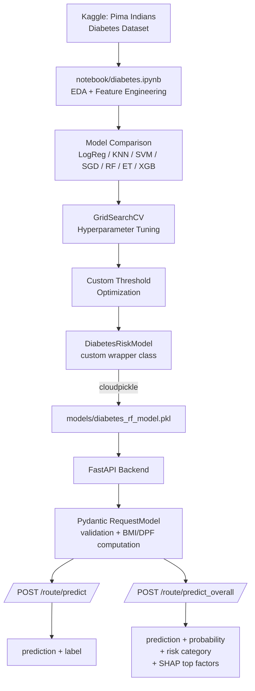

# 🩺 Diabetes Risk Prediction API

A FastAPI backend that serves a custom-thresholded Random Forest model trained on the **Pima Indians Diabetes Dataset**, with SHAP-based explainability so predictions come with a "why," not just a "what."

Built as a hands-on learning project to go from a raw Kaggle dataset → trained model → production-style API, covering EDA, model selection, threshold tuning, custom model serialization, and a validated REST interface.

> ⚠️ **Disclaimer:** This is a screening/educational tool, not a diagnostic one. The underlying dataset consists exclusively of women of Pima Indian heritage (age 21+), so predictions for patients outside that population are statistically unreliable. This project is intended for clinicians/verified data entry, not self-diagnosis by patients, and should never replace professional medical evaluation.

---

## 📋 Table of Contents

- [Overview](#-overview)
- [Project Structure](#-project-structure)
- [How It Works](#-how-it-works)
- [Model Details](#-model-details)
- [Tech Stack](#-tech-stack)
- [API Reference](#-api-reference)
- [Setup & Installation](#-setup--installation)
- [Running the Project](#-running-the-project)
- [Author](#-author)

---

## 🔍 Overview

This project has two halves that work together:

1. **`notebook/`** — the data science side. EDA, preprocessing, feature engineering, model comparison (Logistic Regression, KNN, SVM, SGD, Random Forest), hyperparameter tuning via `GridSearchCV`, and custom decision-threshold optimization. Two HTML exports are included (`diabetes_v1.html`, `diabetes_v2_latest.html`) to show the model's evolution from an earlier iteration to the current one.
2. **`app/`** — the backend side. A FastAPI service that validates incoming patient data with Pydantic, engineers derived features (BMI, a family-history-based Diabetes Pedigree Function proxy), runs inference through the trained model, and — for the "overall" endpoint — explains *why* the model reached its prediction using SHAP.

---

## 📁 Project Structure

```
diabetes-classification-model
├── app
│   ├── core
│   │   └── config.py          # App configuration
|   |   └── logger.py                # Logging setup
│   ├── main.py                 # FastAPI entrypoint
│   ├── models
│   │   ├── request_model.py    # Pydantic request schema
│   │   └── response_model.py   # Pydantic response schema
│   ├── routes/                  # API route definitions
|   |   └── predict.py
│   └── service/                 # Prediction & SHAP explanation logic
|   |   └── predit_func.py
├── models
│   └── diabetes_rf_model.pkl   # Trained model artifact (cloudpickle)
├── notebook
│   ├── diabetes.ipynb          # EDA → training → threshold tuning
│   ├── diabetes_v1.html        # Earlier model iteration (export)
│   └── diabetes_v2_latest.html # Current model iteration (export)
├── pyproject.toml              # taskipy task definitions
├── requirements.txt
├── run.py                      # App runner
└── setup_venv.ps1              # Environment setup script
```

---

## ⚙️ How It Works



**Why `cloudpickle` instead of plain `pickle`/`joblib`?**<br> The trained model is wrapped in a custom `DiabetesRiskModel` class (to bundle the fitted pipeline with a tuned decision threshold). Standard `pickle`/`joblib` serialization only stores a *module reference* to a class, not its actual code — which breaks when the class was originally defined in a notebook. `cloudpickle` serializes the class definition itself, so the model loads correctly in the backend without needing the notebook environment.

---

## 🤖 Model Details

| | |
|---|---|
| **Dataset** | Pima Indians Diabetes Dataset (Kaggle) |
| **Algorithm** | Random Forest Classifier (`scikit-learn`) |
| **Tuning** | `GridSearchCV` for hyperparameters, custom threshold search for decision boundary |
| **Decision threshold** | `0.349` (tuned instead of default `0.5`, to better balance precision/recall for this dataset's class imbalance) |
| **Serialization** | Custom `DiabetesRiskModel` wrapper class, saved via `cloudpickle` |

### Test Set Evaluation 

| Class | Precision | Recall | F1-score | Support |
|---|---|---|---|---|
| 0 (Non-Diabetic) | 0.86 | 0.54 | 0.66 | 95 |
| 1 (Diabetic) | 0.33 | 0.70 | 0.45 | 50 |
| **Accuracy** | | | **0.66** | 145 |
| **Macro avg** | 0.59 | 0.62 | 0.55 | 145 |
| **Weighted avg** | 0.71 | 0.66 | 0.64 | 145 |

**ROC-AUC:** `0.785`

---

## 🧰 Tech Stack

**Backend / API**
- FastAPI, Uvicorn
- Pydantic v2 (validation, computed fields, response schemas)
- taskipy (task runner)

**ML / Data**
- scikit-learn (Random Forest, GridSearchCV)
- pandas, numpy
- SHAP (per-prediction explainability)
- cloudpickle (model serialization)

**Notebook / EDA**
- Jupyter, matplotlib, seaborn

---

## 📡 API Reference

Interactive documentation (Swagger UI) is available at **`/docs`** once the server is running, with a ReDoc alternative at **`/redoc`**.

### `POST /route/predict`

Returns a raw prediction with a human-readable label. No explainability — lighter and faster.

<details>
<summary>Request body</summary>

```json
{
  "Age": 45,
  "Pregnancies": 2,
  "Glucose": 165,
  "BloodPressure": 80,
  "SkinThickness": 35,
  "Insulin": 175,
  "height": 1.7,
  "weight": 90,
  "parental_diabetic": true,
  "siblings_diabetic_count": 1,
  "extended_family_diabetic_count": 0
}
```
</details>

<details>
<summary>Response</summary>

```json
{
  "predict": "Diabetic"
}
```
</details>

### `POST /route/predict_overall`

Same input, richer output — probability, risk category, and the top features driving *this specific* prediction (via SHAP).

<details>
<summary>Response</summary>

```json
{
  "top_contributing_factors": [
    {
      "feature": "Glucose",
      "value": 165,
      "impact": "increased risk",
      "weight": 0.147
    },
    {
      "feature": "DiabetesPedigreeFunction",
      "value": 0.55,
      "impact": "increased risk",
      "weight": 0.031
    },
    {
      "feature": "BMI",
      "value": 31.14186851211073,
      "impact": "increased risk",
      "weight": 0.027
    }
  ],
  "diabetes_probability_percentage": "72.88%",
  "non_diabetes_probability_percentage": "27.12%",
  "predict": "Diabetic",
  "diabetes_risk_category": "High Risk"
}
```
</details>

**Notes on input fields:**
- `height` (metres) and `weight` (kg) are provided raw — the API computes `BMI` internally.
- `parental_diabetic`, `siblings_diabetic_count`, and `extended_family_diabetic_count` feed a simplified proxy calculation for `DiabetesPedigreeFunction`, since the original clinical formula isn't something a user/clinician can supply directly.
- Both derived features (`BMI`, `DiabetesPedigreeFunction`) are computed automatically and are visible in the `/docs` schema, but aren't user-supplied inputs.

---

## 🛠 Setup & Installation

**Prerequisites:** Python 3.13, PowerShell (Windows)

```powershell
# 1. Clone the repo
git clone https://github.com/sachinadk2011/diabetes-classification-model.git
cd diabetes-classification-model

# 2. Create and activate a virtual environment
python -m venv venv
.\venv\Scripts\Activate.ps1

# 3. Install dependencies
pip install -r requirements.txt
```

This project doesn't require any `.env` file or external configuration — it runs fully self-contained with the bundled model artifact.

---

## ▶️ Running the Project

This project uses [`taskipy`](https://github.com/taskipy/taskipy) to simplify common commands, defined in `pyproject.toml`:

```powershell
# Installs/syncs dependencies via setup_venv.ps1
task setup

# Starts the FastAPI server (via run.py)
task start
```

Once running, the API will be available at:

- **App:** `http://127.0.0.1:8001`
- **Swagger docs:** `http://127.0.0.1:8001/docs`
- **ReDoc:** `http://127.0.0.1:8001/redoc`

---

## 👤 Author

**Sachin Adhikari**
